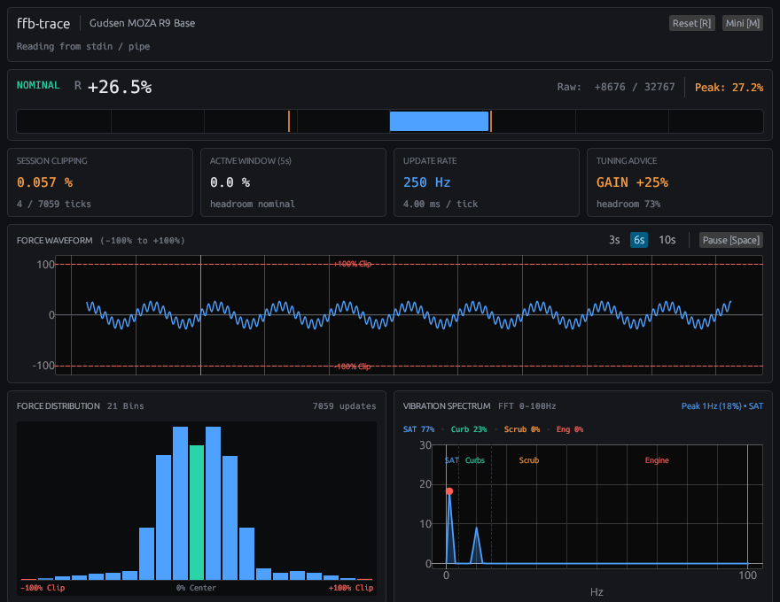

# ffb-trace

Real-time Force Feedback (FFB) clipping and telemetry monitor for Linux sim racing.



> [!CAUTION]
> **Risk of Personal Injury and Hardware Damage**
>
> Force feedback hardware (especially Direct Drive wheelbases) can produce high torque and sudden, violent movements. Increasing force feedback gain can cause severe physical injury or equipment damage.
>
> - All gain tuning advice in `ffb-trace` is based on software signal levels. It does not account for your wheelbase torque rating, physical strength, or mounting rig rigidity.
> - Always adjust gain in small increments. Keep hands and body clear of spokes during violent oscillations, spins, or crashes.
> - **You use this software and apply its recommendations entirely at your own risk.** The authors accept no liability for any personal injury, hardware failure, or property damage.

---

## Features

### Telemetry Dashboard

High-contrast dark GUI built with `egui`, aligned with `sms-telemetry` design tokens.

- **Force Gauge** — Bidirectional bar (`-100%` to `+100%`) with graduation ticks and peak hold.
- **400 ms Clipping Latch** — Keeps transient single-tick clipping visible to the human eye.
- **Gain Tuning Advice** — Computes peak headroom and recommends gain adjustments (`GAIN +15%`, `GAIN -8%`, `OPTIMAL`).
- **Force Waveform** — Rolling time-series (`3s` / `6s` / `10s`) with zero line and clipping boundary markers.
- **Force Distribution** — 21-bin histogram showing signal balance and edge saturation.
- **Vibration Spectrum (FFT)** — Real-time 256-point frequency decomposition (0–100 Hz) with energy breakdown across 4 motorsport bands:

  | Band | Range | Signal Source |
  |------|-------|---------------|
  | SAT | 0–4 Hz | Steering self-aligning torque, load transfer |
  | Curbs | 4–15 Hz | Chassis roll/pitch, bump rumble |
  | Scrub | 15–40 Hz | Tire slip angle, road surface texture |
  | Engine | 40+ Hz | Engine harmonics, ABS pulsation, drivetrain lash |

### Mini-HUD Mode

Compact always-on-top overlay strip (440 × 96) for multi-monitor or in-cockpit use. Launch with `--mini` or toggle with `M`.

### Keyboard Shortcuts

| Key | Action |
|-----|--------|
| `Space` | Pause / Resume waveform |
| `R` | Reset session metrics |
| `M` | Toggle Mini-HUD / Full Dashboard |

### Privacy & Performance

- Device serial numbers are masked by default (`••••••••`). Click to reveal.
- Single standalone Rust binary with minimal CPU/GPU overhead during races.

---

## Usage

### On-Demand Launch (Recommended)

Auto-detects your wheel and intercepts FFB calls:

```bash
# Launch a Steam game (e.g. Project CARS 2)
ffb-trace run steam steam://rungameid/378860

# Launch any native/Proton sim
ffb-trace run /path/to/game

# As a Steam launch option
ffb-trace run -- %command%
```

### Standalone Monitor

Attach to an already-running session:

```bash
# Auto-follow the newest log in ~/.local/state/ffb-trace/
ffb-trace

# Trace a specific log file
ffb-trace --file /path/to/session.log

# Mini-HUD overlay
ffb-trace --mini

# Headless terminal mode
ffb-trace --no-gui
```

---

## Installation

Requires the Rust toolchain (`cargo` and `rustc`):

```bash
curl --proto '=https' --tlsv1.2 -sSf https://sh.rustup.rs | sh
```

Build and install:

```bash
cargo build --release
cp target/release/ffb-trace ~/.local/bin/
```

---

## Architecture

```text
Sim Racing Game (Proton / Native)
       │
       ▼
   libffbwrapper.so (intercepts EVIOCSFF ioctl)
       │
       ├──► ~/.local/state/ffb-trace/*.log
       │          │
       │          ▼
       │      ffb-trace (Rust)
       │          ├─ parser    → parse ffbwrap log lines
       │          ├─ tracker   → clipping stats, histogram, peak hold
       │          ├─ spectrum  → FFT vibration analysis
       │          └─ ui        → egui dashboard (Waveform, Distribution, Spectrum)
       ▼
Linux evdev Kernel Subsystem → Steering Wheel Base
```

### How It Works

`ffb-trace` intercepts force feedback at the OS boundary — between the game and the Linux `evdev` subsystem — using `libffbwrapper.so` (`ioctl(EVIOCSFF)` hook). This captures the exact digital force values from the physics engine before any wheelbase-side filtering.

In the Linux kernel FFB API, force levels are signed 16-bit integers (`-32768` to `+32767`). Clipping occurs when `|level| >= 32767` — a mathematical fact, not a subjective impression. Gain advice derives from measured peak headroom and histogram distribution across the session, enabling repeatable, evidence-based calibration.

---

## License & Credits

- `ffb-trace` is licensed under **GPL-3.0-only**. See the [LICENSE](LICENSE) file.
- The embedded interceptor (`c/ffbwrapper.c`) is derived from [ffbtools](https://github.com/berarma/ffbtools) by Bernat Arlandis, licensed under GPL-3.0-or-later. All copyright headers are preserved.
