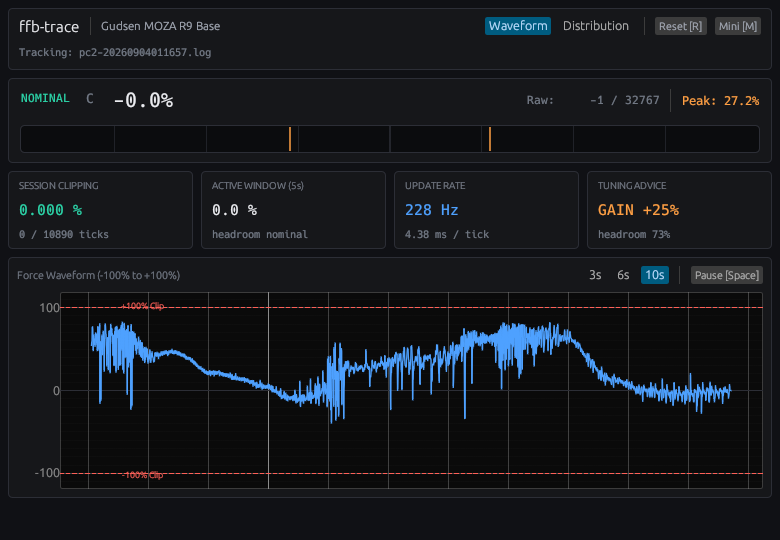

# ffb-trace

Real-time Force Feedback (FFB) clipping and telemetry monitor for Linux sim racing.



`ffb-trace` monitors Linux `evdev` force feedback calls in real time. It detects force clipping, computes update rates (Hz), provides actionable gain tuning advice, and renders live force waveforms.

---

## Core Principle: Empirical Ground Truth

Sim racers often tune force feedback based on subjective feel, wheelbase LEDs, or vendor software filters. This introduces bias and guesswork. `ffb-trace` replaces subjective impressions with **empirical ground truth**:

- **OS Boundary Interception**: `libffbwrapper.so` hooks `ioctl(EVIOCSFF)` calls between the game and the Linux `evdev` subsystem. It captures the exact digital force values issued by the physics engine before any wheelbase driver alterations.
- **Mathematical Saturation**: In the Linux kernel force feedback API, force levels use signed 16-bit integers (`-32768` to `+32767`). Clipping is an objective mathematical fact: whenever `|level| >= 32767`, software dynamic range is exhausted and telemetry details are flattened.
- **Data-Driven Tuning**: Gain advice derives from measured peak headroom and histogram distribution across the entire session, enabling repeatable, evidence-based calibration.

---

## Features

- **Motorsport Telemetry GUI (`egui`)**:
  - High-contrast dark telemetry theme aligned with `sms-telemetry` design tokens.
  - Large bidirectional master force gauge (`-100%` to `+100%`) with tick marks and peak hold.
  - **400ms Clipping Alert Latch**: Keeps transient single-tick clipping clearly visible.
  - **Actionable Gain Tuning Advice**: Computes peak dynamic headroom and advises gain adjustments (`GAIN +15%`, `GAIN -8%`, `OPTIMAL`).
  - **Unified Triple-Card Telemetry Dashboard**:
    - **Force Waveform Card**: Rolling time-series curve (`3s`, `6s`, `10s`), zero line, and clipping boundary markers.
    - **Force Distribution Card**: 21-bin force histogram showing overall signal balance and edge saturation.
    - **Vibration Spectrum Card (FFT)**: Real-time frequency decomposition (0–100 Hz) identifying dominant vibration peaks and energy breakdown across 4 motorsport bands (Steering/SAT, Chassis/Curbs, Road Texture/Scrub, Engine/ABS).
  - **Mini-HUD Mode (`--mini` or press `M`)**: Compact always-on-top overlay strip (440x96) for multi-monitor or in-cockpit viewing.
  - **Hardware Privacy**: Device serial numbers are masked by default (`••••••••`), click to reveal/hide.
  - **Driver Rig Ergonomics**:
    - `Space`: Pause / Resume waveform scroll
    - `R`: Reset session metrics
    - `M`: Toggle Mini-HUD / Full Dashboard
- **Multi-Directory Auto-Detection**:
  - Automatically tracks the newest active session across `~/.local/state/ffb-trace/` and `~/ffblogs/`.
  - Seamlessly resets and tracks new sessions when the game restarts.
- **Lightweight Native Binary**:
  - Single standalone binary written in Rust.
  - Uses minimal CPU and GPU resources during races.

---

## Installation

### Prerequisites

- Rust toolchain (`cargo` and `rustc`):
  ```bash
  curl --proto '=https' --tlsv1.2 -sSf https://sh.rustup.rs | sh
  ```

### Build

```bash
cargo build --release
```

Copy the binary to your local path:
```bash
cp target/release/ffb-trace ~/.local/bin/
```

---

## Usage

### Method 1: Simple On-Demand Launch (Recommended)

You do not need to look up device paths or configure complex parameters. `ffb-trace` auto-detects your wheel and runs the game:

```bash
# Launch a Steam game directly (e.g. Project CARS 2)
ffb-trace run steam steam://rungameid/378860

# Or launch any native/Proton sim command
ffb-trace run /path/to/game
```

If you prefer launching from Steam, set this minimal option once:
```bash
ffb-trace run -- %command%
```

### Method 2: Standalone Live Monitor

If your game is already running or writing to a log:

```bash
# Auto-follow the newest session log in ~/.local/state/ffb-trace/
ffb-trace

# Trace a specific log file
ffb-trace --file /path/to/session.log

# Start in compact Mini-HUD overlay mode (always-on-top)
ffb-trace --mini

# Run in headless terminal mode
ffb-trace --no-gui
```

---

## Alignment with sms-telemetry

`ffb-trace` adopts the exact dark palette, contrast tokens, and line styling defined in `sms-telemetry`'s `theme.css`.

---

## Architecture

```text
Sim Racing Game (Proton / Native)
       │
       ▼
   libffbwrapper.so (intercepts EVIOCSFF ioctl)
       │
       ├─► ~/.local/state/ffb-trace/*.log (or FIFO pipe)
       │         │
       │         ▼
       │     ffb-trace (Rust Desktop App)
       │         │
       │         └─► egui Desktop GUI (Waveform, Force Bar, Clip Alert)
       ▼
Linux evdev Kernel Subsystem -> Steering Wheel Base
```

---

## Safety Warning & Disclaimer

> [!CAUTION]
> **Risk of Personal Injury and Hardware Damage**
>
> Force feedback hardware (especially Direct Drive wheelbases) can produce high torque and sudden, violent movements. Increasing force feedback gain can cause severe physical injury (including sprains, fractures, or bruises) or equipment damage.
>
> - **Informational estimates only**: All gain tuning advice and telemetry metrics in `ffb-trace` are mathematical calculations based on software signal levels. They do not consider your wheelbase torque rating, physical strength, or mounting rig rigidity.
> - **Adjust gain gradually**: Always adjust gain in small increments and test carefully. Keep hands and body clear of spokes and moving parts during violent oscillations, spins, or crashes.
> - **Assumption of risk and disclaimer of liability**: You use this software and apply its recommendations entirely at your own risk. The authors and contributors accept no responsibility or liability for any personal injury, hardware failure, or property damage resulting from the use of `ffb-trace`.

---

## License & Credits

- `ffb-trace` is licensed under **GPL-3.0-only**. See the [LICENSE](LICENSE) file.
- The embedded interceptor (`c/ffbwrapper.c`) is derived from [ffbtools](https://github.com/berarma/ffbtools) by Bernat Arlandis, licensed under GPL-3.0-or-later. All copyright headers are preserved.

